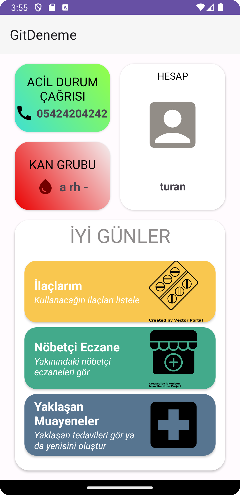
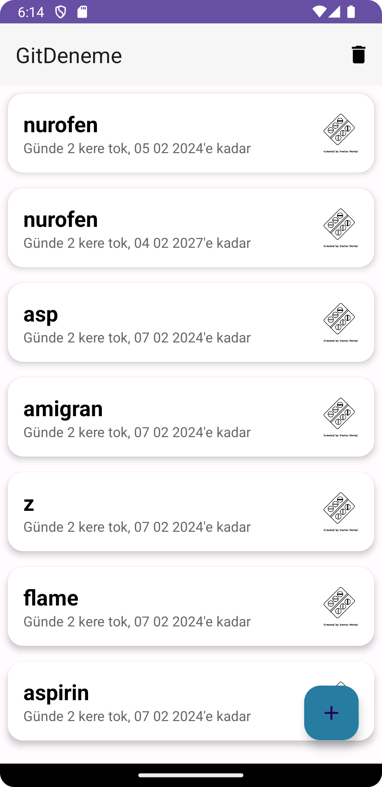
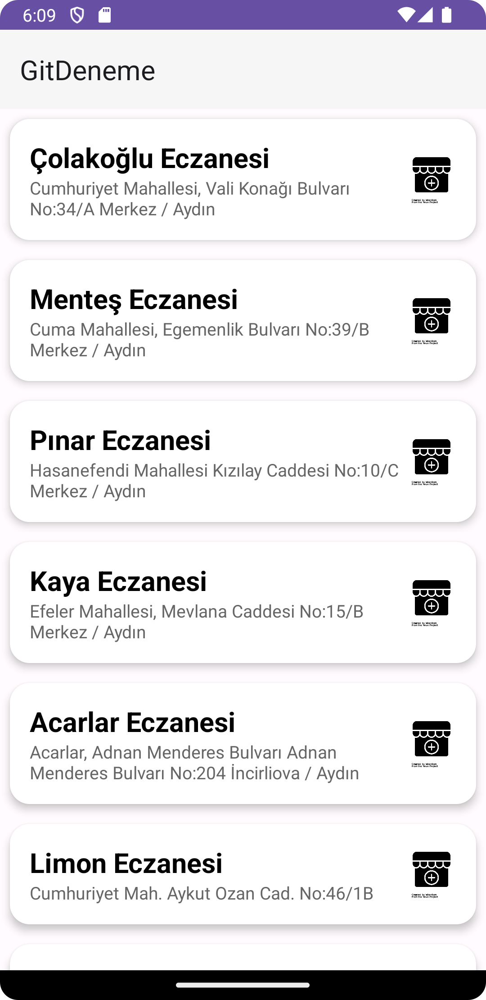
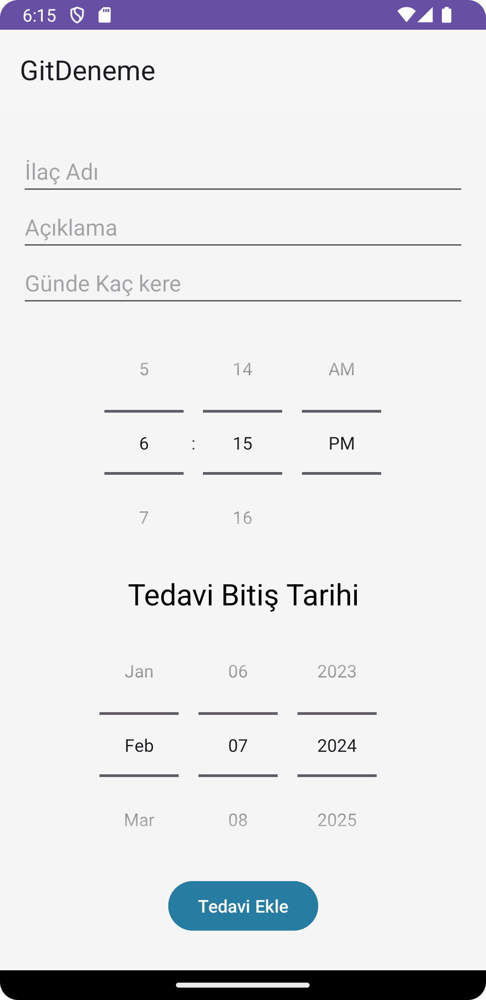
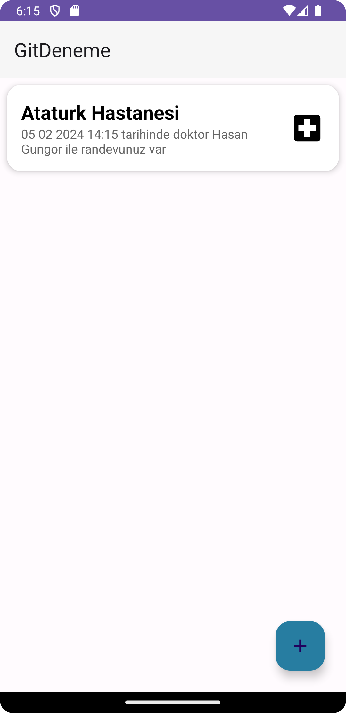
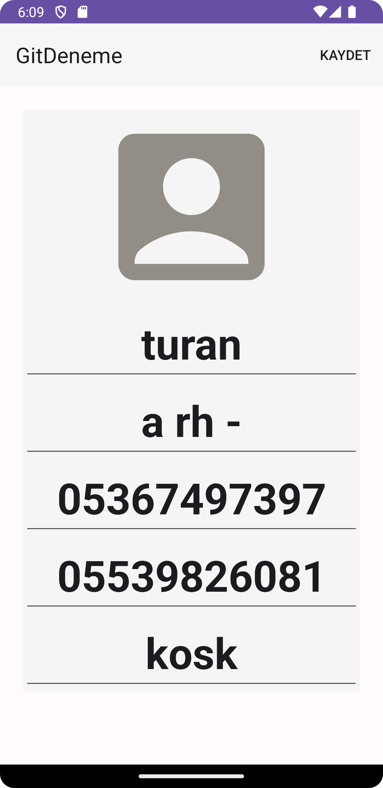
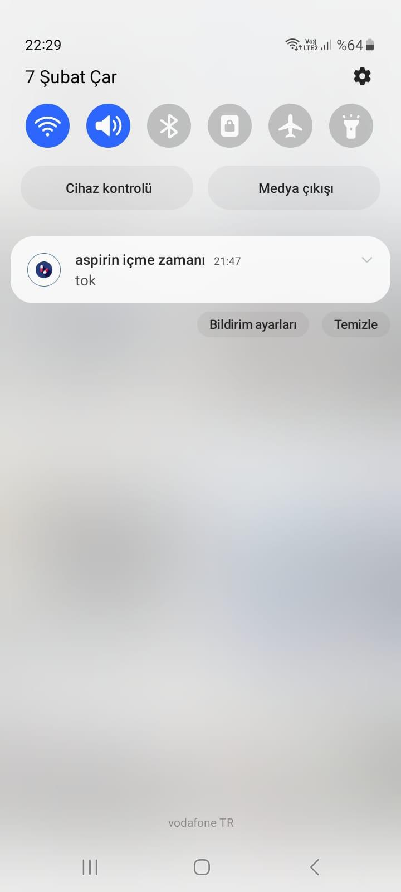

Uygulamam, kullanıcıların ilaç takibi, doktor randevularını yönetme ve eczanelerle ilgili bilgilere kolayca erişebilmelerini sağlamak üzere tasarlanmış kapsamlı bir sağlık ve ilaç yönetimi uygulamasıdır.

Özellikler:
•	İlaç Takibi: Kullanıcıların ilaçlarını ve alım saatlerini kolayca takip etmelerini sağlar. İlaç adı, dozajı, alım zamanları gibi detaylar kaydedilebilir.
•	Doktor Randevuları: Kullanıcıların sağlık kontrol tarihlerini kaydetmelerine ve yaklaşan randevular için hatırlatmalar alabilmelerine olanak tanır.
•	Eczane Bilgileri: Kullanıcılara yakınlarındaki eczanelerin konumları, iletişim bilgileri ve açık oldukları saatler hakkında bilgiler sunar.
•	Kişisel Sağlık Bilgileri: Kullanıcıların kişisel sağlık bilgilerini (kan grubu, adres vb.) kaydetmelerine ve gerektiğinde güncellemelerine imkan verir.
•	Alarm ve Bildirimler: İlaç alım zamanları ve doktor randevuları için kullanıcıları uyaran alarm ve bildirim sistemleri.

Kullanılan Teknolojiler:
•	ViewModel, LiveData, Navigation ve Room 
•	Retrofit ve Gson: REST API'lerle etkileşimde bulunmak ve JSON verilerini işlemek için kullanılır.
•	RxJava ve RxAndroid
•	AlarmManager ve BroadcastReceiver: İlaç hatırlatıcıları ve randevu bildirimleri için kullanılır.
•	Material Design: Kullanıcı arayüzü bileşenleri ve etkileşimleri için modern tasarım prensipleri.
•	Data Binding ve View Binding: Arayüz bileşenleri ile veri modelleri arasında bağlama yaparak kodun daha temiz ve yönetilebilir olmasını sağlar.

